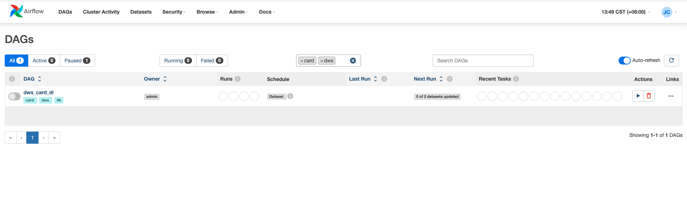

# Airflow 2.8.4 自定义修改



## 修改说明

### 修改点：DAG Tag 过滤逻辑

**文件位置**: `airflow/www/views.py` (第 796-798 行)

**修改内容**: 将 DAG tag 过滤从 OR 逻辑改为 AND 逻辑

**修改前（OR 逻辑）**:
```python
if arg_tags_filter:
    cond = [DagModel.tags.any(DagTag.name == tag) for tag in arg_tags_filter]
    dags_query = dags_query.where(or_(*cond))
```
- 选择多个 tag 时，显示包含**任意一个**选中 tag 的 DAG

**修改后（AND 逻辑）**:
```python
if arg_tags_filter:
    for tag in arg_tags_filter:
        dags_query = dags_query.where(DagModel.tags.any(DagTag.name == tag))
```
- 选择多个 tag 时，只显示**同时包含所有**选中 tag 的 DAG

### 功能说明

**示例场景**:
- DAG A: tags = ['tag1']
- DAG B: tags = ['tag2']
- DAG C: tags = ['tag1', 'tag2']

**选择 `tag1` 和 `tag2` 时的行为**:
- ✅ DAG C: 显示（同时有 tag1 和 tag2）
- ❌ DAG A: 不显示（只有 tag1，没有 tag2）
- ❌ DAG B: 不显示（只有 tag2，没有 tag1）

## 部署方式

### 前置条件

1. 确保已安装 Airflow 2.8.4
2. 确认 conda 环境路径正确
3. 确保有文件写入权限

### 手动部署（推荐）

1. **备份原文件**
   ```bash
   cp <环境名称>/lib/python3.10/site-packages/airflow/www/views.py \
        <环境名称>/lib/python3.10/site-packages/airflow/www/views.py.backup.$(date +%Y%m%d_%H%M%S)
   ```

2. **复制修改后的文件**
   ```bash
   cp airflow/www/views.py \
        <环境名称>/lib/python3.10/site-packages/airflow/www/views.py
   ```

3. **清理 Python 缓存**
   ```bash
   rm -f <环境名称>/lib/python3.10/site-packages/airflow/www/__pycache__/views.*.pyc
   ```

4. **重启 Airflow webserver**
   ```bash
   conda activate <环境名称>
   airflow webserver --stop
   airflow webserver --port <端口号>
   ```